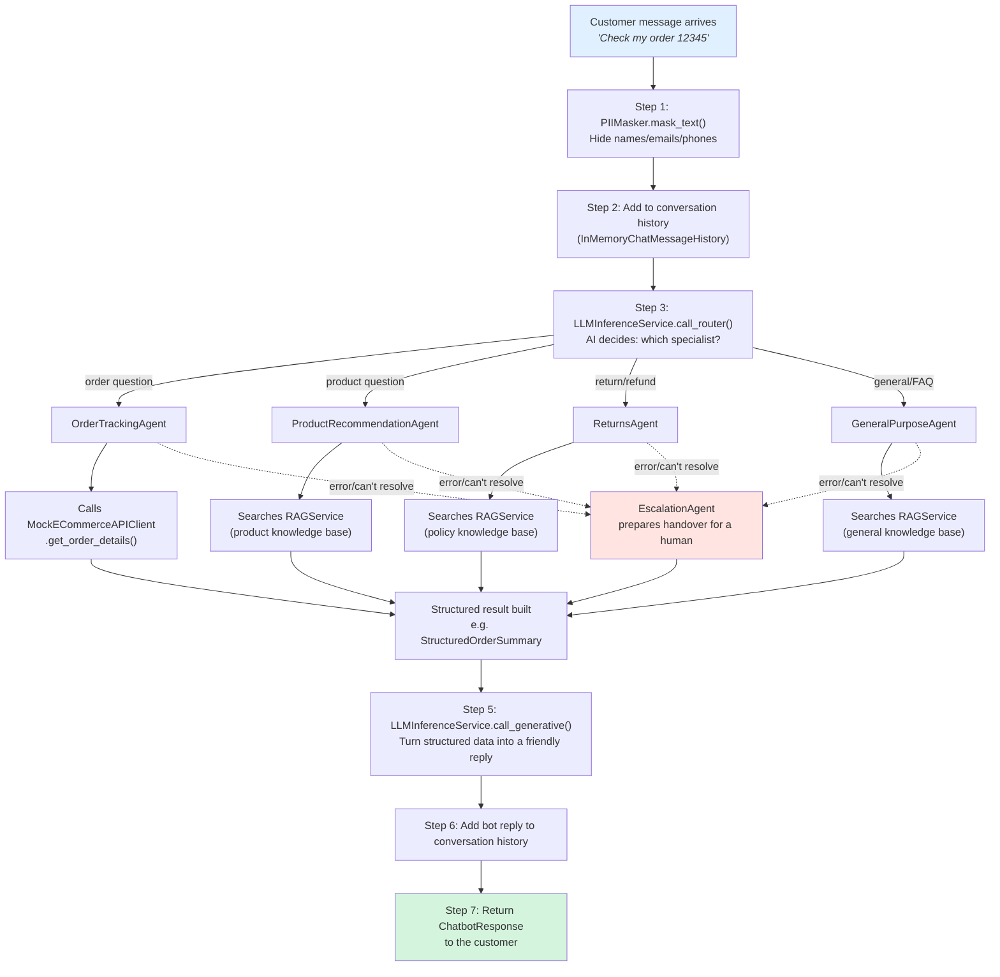

# 🤖 AI Agentic Customer Support Platform — How It Works

This document walks through **exactly what happens, step by step**, when you run `main_simulation.py`. No jargon — just what gets called, what goes in, what comes out, and why each step exists. If you read nothing else in this project, read this.

Think of `main_simulation.py` as a stage director: it wakes up every actor (service/agent), hands them a script (sample customer messages), and lets you watch the whole play unfold in your terminal.

---

## 📑 Table of Contents

1. [The cast of characters](#1-the-cast-of-characters)
2. [Startup: stocking the shelves (Data Ingestion)](#2-startup-stocking-the-shelves-data-ingestion)
3. [Hiring the staff: Agents and the Orchestrator](#3-hiring-the-staff-agents-and-the-orchestrator)
4. [A single customer interaction, start to finish](#4-a-single-customer-interaction-start-to-finish)
5. [Workflow diagram](#5-workflow-diagram)
6. [What the whole simulation actually demonstrates](#6-what-the-whole-simulation-actually-demonstrates)
7. [Where to look if you want to see the code yourself](#7-where-to-look-if-you-want-to-see-the-code-yourself)

---

## 1. The cast of characters

Before any conversation happens, the simulation builds seven "workers," each with one clear job. This happens once, at startup — like opening a store before customers walk in.

| Worker (class) | Its one job | Analogy |
|---|---|---|
| `PIIMasker` | Find and hide personal details (names, emails, phone numbers) before anything is sent to an AI model | The front-desk clerk who blacks out sensitive info before photocopying a form |
| `LLMInferenceService` | Talk to the actual AI model (Groq/Ollama/Anthropic) — routing decisions, generating replies | The translator who phrases everything into a customer-friendly sentence |
| `RAGService` | Store and search company knowledge (policies, product info, past conversations) | The reference librarian who fetches the right page instantly |
| `MockECommerceAPIClient` | Look up real order/customer data (stands in for a real CRM/order database) | The warehouse clerk who checks a shipment's status |
| `DataIngestionPipeline` | Clean, anonymise, and file away raw data so it's searchable later | The archivist who organises paperwork into labelled folders |
| Five **Agents** (`OrderTrackingAgent`, `ProductRecommendationAgent`, `ReturnsAgent`, `GeneralPurposeAgent`, `EscalationAgent`) | Each handles one *type* of request | Specialist staff — one handles shipping questions, one handles product advice, one handles returns, one's a generalist, one hands off to a human |
| `AgentOrchestratorService` | The manager who listens to the customer, decides which specialist to call, and delivers the final answer | The call-centre supervisor who routes your call and reads back the resolution |

Every one of these is a real Python class in this codebase. Nothing here is invented for this explanation — you can open the file and read the exact code.

---

## 2. Startup: stocking the shelves (Data Ingestion)

Before any customer can be helped, the "store" needs stock — a knowledge base the AI can search. This is `DataIngestionPipeline`'s job, and it runs three times in the simulation, once per data source:

### 2a. Past customer conversations → `pipeline.ingest_customer_conversations(raw_conversations)`

**Input:** Raw, messy conversation text, e.g.:
> *"Hi, my name is John Doe, and I want to know about my order 12345."*

**What happens inside, step by step:**
1. **Clean it** — lowercase, strip extra whitespace, remove stray HTML/URLs.
2. **Mask it** — hand the text to `PIIMasker.mask_text()`, which turns `John Doe` into `[NAME]` and any email/phone into `[EMAIL]`/`[PHONE]`. This is a hard rule in this system: **no personal data is ever allowed to reach the AI model.**
3. **Chunk it** — if the text is long, `RecursiveCharacterTextSplitter` breaks it into bite-sized pieces (so search results later are focused, not walls of text).
4. **Store it** — each chunk is embedded (turned into a list of numbers that captures its *meaning*, not just its words) and saved into `RAGService`, which is backed by a ChromaDB vector database.

**Output:** A list of `CleanedCustomerConversation` records, and the chunks are now searchable in the knowledge base.

> 💡 **Why it matters:** Later, when a customer asks "what's your return policy," the system needs *something* to search. This step is what makes that search possible — and doing the PII-masking here (at ingestion time, not later) means sensitive data never even gets a chance to leak downstream.

### 2b. Product catalogue → `pipeline.ingest_product_catalog(raw_products)`

Same idea, but for products: descriptions, specs, and customer reviews. Reviews go through PII-masking too — the sample data even has a review that mentions someone's name (`"...Jane Smith recommended it to me!"`), which gets masked exactly like a conversation would.

> 💡 **Why it matters:** This is what lets `ProductRecommendationAgent` later "know about" the gaming laptop, headphones, and smartwatch in the sample catalogue.

### 2c. Company policies → `pipeline.ingest_policy_documents(policies)`

Plain policy text (returns, warranty, shipping) gets chunked and stored the same way.

> 💡 **Why it matters:** This is what lets `ReturnsAgent` and `GeneralPurposeAgent` answer policy questions accurately instead of guessing.

### (Optional) 2d. Real-world Twitter support data → `pipeline.ingest_twitter_support_csv(csv_path)`

If a CSV like the sample "Customer Support on Twitter" dataset is present, this method pairs up each customer tweet with the company's actual reply (using the CSV's `response_tweet_id` column), turns each pair into a mini-conversation, and ingests it exactly like 2a. This is how the system can be seeded with *real* historical support data instead of only hand-written examples.

**After this whole stocking phase**, `rag_service.collection_size()` reports how many searchable chunks exist — in a typical run, this grows from 0 → 9 (policies) → 58+ (once Twitter data is added).

---

## 3. Hiring the staff: Agents and the Orchestrator

```python
agents = {
    "OrderTrackingAgent":         OrderTrackingAgent(...),
    "ProductRecommendationAgent": ProductRecommendationAgent(...),
    "GeneralPurposeAgent":        GeneralPurposeAgent(...),
    "ReturnsAgent":               ReturnsAgent(...),
    "EscalationAgent":            EscalationAgent(...),
}
orchestrator = AgentOrchestratorService(llm_service, pii_masker, agents)
```

Each agent is handed the same four tools (`llm_service`, `rag_service`, `ecommerce_client`, `pii_masker`) but uses them differently depending on its specialty — like five staff members sharing the same filing cabinet and phone line but each trained for a different kind of call.

The `AgentOrchestratorService` is the one object that the rest of the system actually talks to. Nobody calls an agent directly — they always go through the orchestrator, the same way a customer never picks their own specialist; the supervisor routes the call.

---

## 4. A single customer interaction, start to finish

This is the heart of the system. Every customer message goes through the exact same seven-step pipeline, no matter what they ask. Let's trace **one real example** captured from an actual simulation run.

**Customer says:** *"Hi, I'd like to check my order status for order 12345."*
**Called as:** `orchestrator.handle_customer_query(query)`

### Step 1 — Mask personal information
`PIIMasker.mask_text(query.text)` scans the message. In this example there's no name/email to hide, so the text passes through unchanged. (Compare this to interaction 2 later, where "my name is Jane Smith" becomes `"my name is [NAME]"` before the AI ever sees it.)

### Step 2 — Remember the conversation so far
The message is added to that session's chat history (`InMemoryChatMessageHistory`). If this is a follow-up question, earlier turns are included here too — this is how the system "remembers" what was said two messages ago.

### Step 3 — Decide who should handle it (Routing)
The masked text + recent history is sent to `LLMInferenceService.call_router()`. This is a genuine AI decision: the model reads the message and picks one of four specialists — `OrderTrackingAgent`, `ProductRecommendationAgent`, `ReturnsAgent`, or `GeneralPurposeAgent` — along with a confidence score.

> For "check my order status for order 12345" → the router picks **`OrderTrackingAgent`**, confidence **0.90**.

*(A quick check happens first: if this exact question was asked very recently, the system reuses the last routing decision instead of asking the AI again — a small optimisation called `Cache1`.)*

### Step 4 — Hand the task to the specialist
The orchestrator builds an `AgentTask` (a small package containing the question, the customer ID, and conversation history) and calls that agent's `process_task(task)` method.

**Inside `OrderTrackingAgent.process_task()`:**
1. It figures out the order number is `12345` (pulled from the routing step or found directly in the text via a pattern match).
2. It asks the AI to plan its next move — this is a small reasoning loop where the AI decides: *"I need to call the order-lookup tool."*
3. It actually calls `MockECommerceAPIClient.get_order_details(customer_id, order_id)` — this is the one place in the whole system that touches something resembling a real database.
   **Output:** `{"order_id": "12345", "status": "Shipped", "items": [...], "estimated_delivery": "2024-08-10"}`
4. It interprets that raw data — is anything wrong with this order? (Here: no, it shipped fine.)
5. It packages everything into a `StructuredOrderSummary` — a clean, predictable shape that any downstream code can rely on, regardless of what the AI happened to say.

> ⚠️ **If something goes wrong here** — the agent can't find the order, the AI itself gets stuck, or any unhandled error occurs — the orchestrator automatically falls back to `EscalationAgent`, which prepares a summary for a human to take over. No customer message is ever silently dropped.

### Step 5 — Turn the structured result into a human sentence
The `StructuredOrderSummary` from Step 4 gets sent to `LLMInferenceService.call_generative()`, along with the conversation history. This is the only step whose entire job is *wording* — turning `status: Shipped, estimated_delivery: 2024-08-10` into an actual warm sentence a customer would want to read.

> **Output:** *"Your order 12345 is currently Shipped. Estimated delivery: 2024-08-10. Note: Order is on its way. Is there anything else I can help you with?"*

### Step 6 — Remember the answer too
The bot's reply is added to the same conversation history as the customer's message — so if they ask a follow-up next, the system has the full back-and-forth.

### Step 7 — Hand back a clean response
The orchestrator returns a `ChatbotResponse` object: the reply text, which agent handled it, and a confidence score. This is what actually gets displayed to the customer (or, in the FastAPI/Streamlit layers, sent back over the API).

```
<<< Support Bot: "Your order 12345 is currently Shipped. Estimated delivery: 2024-08-10.
                   Note: Order is on its way. Is there anything else I can help you with?"
    Agent invoked : OrderTrackingAgent
    Confidence    : 0.90
    Latency       : 0.001s
```

That's it. Every single customer message in this system — order questions, product asks, returns, general questions — goes through these exact same seven steps. Only Step 4 (which specialist, which tools) changes.

---

## 5. Workflow diagram



If your viewer doesn't render Mermaid diagrams, here's the same flow as plain text:

```
Customer message
      |
      v
[1] PIIMasker -- hide personal info
      |
      v
[2] Add to conversation history
      |
      v
[3] AI Router -- pick a specialist
      |
      +-- OrderTrackingAgent ---------> looks up order via ECommerce API
      +-- ProductRecommendationAgent -> searches product knowledge base
      +-- ReturnsAgent ---------------> searches policy knowledge base
      +-- GeneralPurposeAgent --------> searches general knowledge base
              |
              | (any agent can fail/hand off)
              v
      EscalationAgent -- prepares handover for a human
              |
              v
      Structured result (e.g. order status, product pick, policy answer)
              |
              v
[5] AI Generator -- turn structured result into a friendly sentence
              |
              v
[6] Add bot reply to conversation history
              |
              v
[7] Return final answer to the customer
```

---

## 6. What the whole simulation actually demonstrates

`main_simulation.py` runs **five interactions in a row**, each chosen to exercise a different path through the diagram above:

| # | Customer says | Routed to | What it proves |
|---|---|---|---|
| 1 | "Check my order status for order 12345" | `OrderTrackingAgent` | The basic happy path — order lookup, no PII, clean answer |
| 2 | "Actually, my name is Jane Smith. What about order 54321?" (same session as #1) | `OrderTrackingAgent` | **Two things at once:** PII masking catches the name (`Jane Smith` becomes `[NAME]`), *and* conversation memory works — this message reuses the same session as #1 |
| 3 | "Recommend a good laptop for gaming, budget $1200" | `ProductRecommendationAgent` | Looks up the customer's purchase history, then searches the product knowledge base for a match |
| 4 | "What's your return policy? My email is john.doe@example.com" | `ReturnsAgent` | PII masking catches the email; the answer comes from the *ingested policy document*, not a made-up response |
| 5 | "Tell me about your company's history" | `GeneralPurposeAgent` | A question with no good match in the knowledge base -- shows how the system behaves when it *doesn't* have a great answer (falls back to the closest available RAG snippet rather than refusing outright) |

After all five, the simulation prints:
- The **full conversation history** for session 1 (proving interactions 1 and 2 really did share memory)
- The final **knowledge base size** (how many chunks were ingested)
- A live **evaluation snapshot** — average response latency and what percentage of interactions were fully resolved vs. escalated (see `services/evaluation.py` for the full 7-dimension framework this hooks into)

---

## 7. Where to look if you want to see the code yourself

| If you want to understand... | Open this file |
|---|---|
| The one method that runs every customer interaction | `services/orchestrator.py` -> `handle_customer_query()` |
| How personal data gets hidden | `services/pii_masker.py` |
| How the AI decides which specialist to use | `services/llm_inference.py` -> `call_router()` |
| How each specialist actually does its job | `services/agents/*.py` (one file per specialist) |
| How company knowledge gets stored and searched | `services/rag.py` |
| How raw data becomes searchable knowledge | `services/data_pipeline.py` |
| How to measure whether the system is performing well | `services/evaluation.py` |
| The full simulation, start to finish | `main_simulation.py` -- literally the script this whole document explains |

**To run it yourself:**
```bash
pip install -r requirements.txt
cp .env.example .env        # fill in your LLM provider's API key (or leave blank for mock mode)
python main_simulation.py
```
Without any API key filled in, every agent still runs -- it just uses simple rule-based fallback logic instead of AI reasoning, so you can see the *shape* of the system working even with zero setup.
